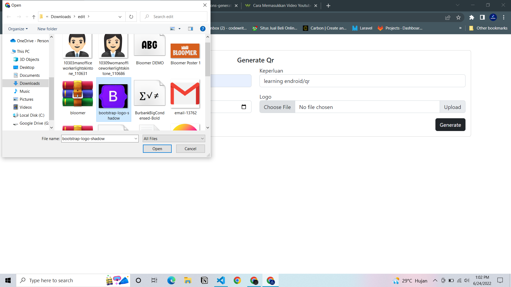
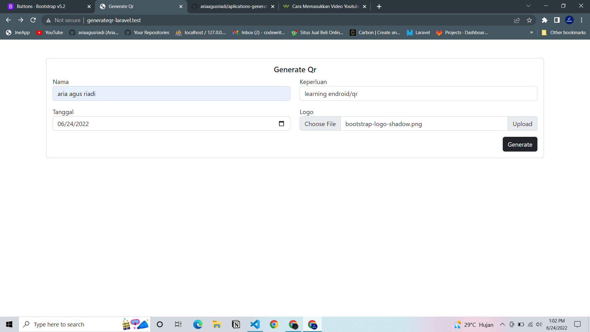
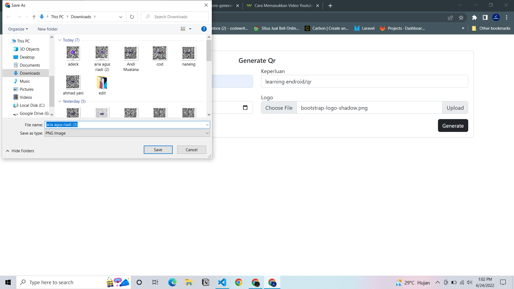
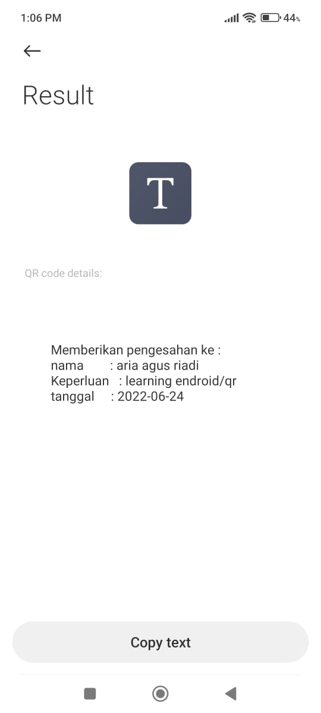

<h1>Aplikasi generate qr code</h1>

    aplikasi ini di buat untuk mengingat hasil dari belajar endroid/qrcode dari https://github.com/endroid/qr-code  
    aplikasi ini di buat menggunakan packagist

<h1>teknologi yang di gunakan antara lain</h1> 

    <ul>
        <li>Laravel 9</li>
        <li>Bootstrap 5</li>
        <li>endroid/qrcode</li>
    </ul>

<h1>Demo</h1>

<h4>Step by step</h4>

 

 

 

 

 
<h4>Output</h4>

 
<h4>Hasil scan</h4>

